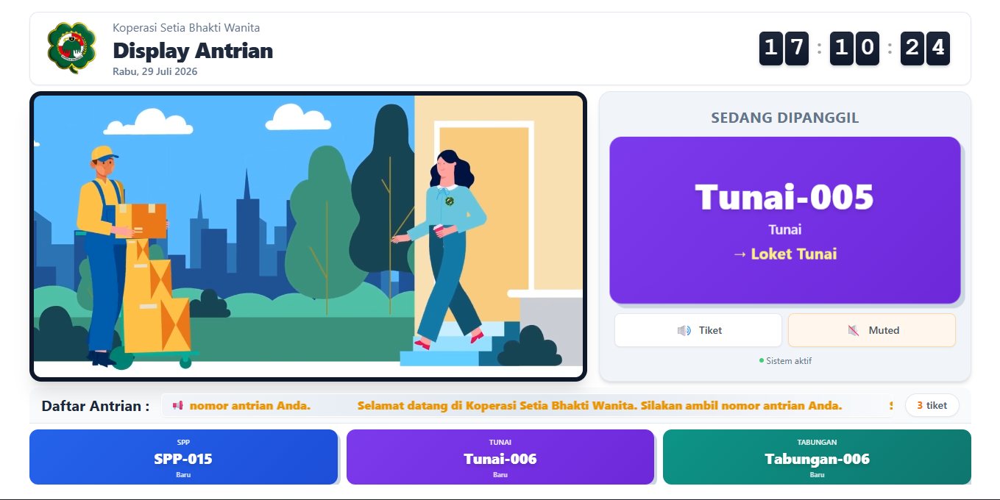

<div align="center">

# 🏦 Antrian SBW

### Sistem Antrian Real-Time untuk Layanan Bank Sampah

[](https://laravel.com)
[](https://www.php.net)
[](https://tailwindcss.com)
[](LICENSE)

Aplikasi berbasis web untuk mengelola sistem antrian nasabah **Bank Sampah**
secara **real-time** dengan tampilan display modern, notifikasi, dan TTS otomatis.

[Fitur](#-fitur-utama) • [Instalasi](#-instalasi) • [Screenshot](#-screenshot) • [Lisensi](#-lisensi)

</div>

---

## 📖 Tentang Project

**Antrian SBW** adalah aplikasi yang dirancang untuk melayani proses antrian
nasabah Bank Sampah dengan:
- Nomor antrian otomatis berdasarkan tipe layanan (SPP, Tunai, Tabungan)
- Tampilan display real-time dengan Text-to-Speech (TTS)
- Notifikasi popup untuk admin/operator
- Multi-user authentication dengan role management

---

## ✨ Fitur Utama

| Fitur | Deskripsi |
|-------|-----------|
| 🎫 **Manajemen Antrian** | Generate, panggil, dan selesaikan tiket antrian otomatis |
| 📺 **Display Real-Time** | Tampilan display dengan polling 2 detik + TTS |
| 🔔 **Notifikasi Popup** | Icon lonceng dengan badge & dropdown notifikasi |
| 👥 **Multi-Role Auth** | Sistem autentikasi dengan role admin & operator |
| 🎨 **UI Modern** | Responsive design dengan Tailwind CSS |
| 📊 **Laporan** | Tracking tiket yang sudah selesai/lunas |

---

## 🚀 Tech Stack

- **Backend**: Laravel 11+ (PHP 8.2+)
- **Frontend**: Blade Templates + Alpine.js + Tailwind CSS
- **Database**: MySQL / MariaDB
- **Auth**: Laravel Breeze
- **Real-Time**: Polling-based (no WebSocket required)

---

## 📦 Instalasi

### Prasyarat
Pastikan sudah terinstall:
- PHP 8.2+
- Composer
- MySQL/MariaDB
- Node.js & NPM

### Langkah Instalasi

1. **Clone repository**
   ```bash
   git clone https://github.com/username/antrian_sbw.git
   cd antrian_sbw
   ```

2. **Install dependencies**
   ```bash
   composer install
   npm install
   ```

3. **Setup environment**
   ```bash
   cp .env.example .env
   php artisan key:generate
   ```

4. **Setup database**
   - Buat database baru di MySQL
   - Sesuaikan konfigurasi `.env` (lihat file `.env.example` untuk referensi)
   ```bash
   php artisan migrate --seed
   ```

5. **Build assets & jalankan server**
   ```bash
   npm run build
   php artisan serve
   ```

6. **Akses aplikasi** di `http://localhost:8000`

> 🔒 **Catatan Keamanan**: File `.env` berisi kredensial sensitif dan **tidak boleh**
> di-commit ke repository publik. Gunakan `.env.example` sebagai template.

---

## 📸 Screenshot

<div align="center">

| Tampilan Display | Tampilan Manajemen Antrian |
|:----------------:|:--------------------------:|
|  | Coming Soon |

</div>

---

## 🛣️ Roadmap

- [x] Sistem antrian real-time
- [x] Tampilan display dengan TTS
- [x] Notifikasi popup
- [ ] Dashboard analytics untuk admin
- [ ] Export laporan ke PDF/Excel
- [ ] Multi-language support (ID/EN)

---

## 🤝 Kontribusi

Kontribusi sangat diterima! Silakan:
1. Fork repository ini
2. Buat branch fitur (`git checkout -b feature/AmazingFeature`)
3. Commit perubahan (`git commit -m 'Add some AmazingFeature'`)
4. Push ke branch (`git push origin feature/AmazingFeature`)
5. Buat Pull Request

---

## 📄 Lisensi

Project ini open-source di bawah lisensi MIT. Anda bebas menggunakan, memodifikasi, dan mendistribusikan dengan menyertakan kredit pembuat.

---

<div align="center">

**Dibuat dengan ❤️ untuk Bank Sampah**

⭐ Jangan lupa beri star jika project ini bermanfaat!

</div>

---

## Daftar Isi

- [Tentang Aplikasi](#tentang-aplikasi)
- [Fitur Utama](#fitur-utama)
- [Peran Pengguna](#peran-pengguna-role)
- [Tipe Antrian](#tipe-antrian)
- [Stack Teknologi](#stack-teknologi)
- [Struktur Direktori](#struktur-direktori)
- [Instalasi](#instalasi)
- [Konfigurasi](#konfigurasi)
- [Menjalankan Aplikasi](#menjalankan-aplikasi)
- [API Endpoints](#api-endpoints)
- [Catatan Keamanan](#catatan-keamanan)
- [Lisensi](#lisensi)

---

## Tentang Aplikasi

**Antrian SBW** adalah sistem manajemen antrian berbasis web yang dirancang untuk instansi/lembaga yang memiliki **beberapa loket layanan** dengan jenis antrian berbeda.
Sistem ini memisahkan alur antrian berdasarkan kategori layanan (Tunai, SPP, Tabungan) dan menyediakan dashboard monitoring real-time untuk operator, serta display publik untuk calon pelanggan.

**Cocok untuk:**
- Lembaga keuangan dengan loket kasir, teller, dan customer service
- Instansi pendidikan dengan loket pembayaran SPP
- Kantor pelayanan publik multi-layanan

---

## Fitur Utama

| Fitur | Deskripsi |
|---|---|
| Cetak tiket antrian | Pengunjung mengambil nomor antrian via halaman mandiri |
| Display publik real-time | Monitor TV/layar besar menampilkan antrian yang sedang dilayani |
| Dashboard operator | Setiap loket punya dashboard untuk memanggil & mengelola antrian |
| Notifikasi real-time | Bell icon di navbar dengan badge unread + popup detail |
| Text-to-Speech (TTS) | Panggilan antrian menggunakan suara otomatis (Web Speech API) |
| Video playlist display | Display publik dapat memutar video pengumuman |
| Running text marquee | Pengumuman berjalan di display publik |
| Cetak kartu anggota | Halaman cetak kartu anggota dengan preview |
| Riwayat panggilan | Log lengkap semua panggilan antrian |
| Manajemen pengguna | Super admin mengelola akun operator per role |
| Pengaturan sistem | Konfigurasi TTS, marquee, video, loket via Settings |
| Role-based access | Middleware membatasi akses sesuai role |

---

## Peran Pengguna (Role)

Sistem menggunakan **4 role** dengan hak akses berbeda:

| Role | Loket | Tipe Antrian |
|---|---|---|
| `super_admin` | Semua loket | Tunai, SPP, Tabungan |
| `admin_kasir` | Loket Tunai | Tunai |
| `admin_spp` | Loket SPP | SPP |
| `admin_pj_kartu` | Loket Tabungan | Tabungan |

> **Catatan**: `super_admin` memiliki akses penuh termasuk manajemen user, settings, dan semua dashboard operator.

---

## Tipe Antrian

| Tipe | Kode Awalan | Keterangan |
|---|---|---|
| Tunai | A | Pembayaran tunai di loket kasir |
| SPP | B | Pembayaran SPP / iuran |
| Tabungan | C | Layanan kartu & tabungan |

---

## Stack Teknologi

### Backend
- PHP `^8.1`
- Laravel Framework `^10.10`
- Laravel Sanctum `^3.3` (API token auth)
- Laravel Breeze `^1.29` (auth scaffolding)

### Frontend
- Alpine.js `^3.4` (reactive components)
- Tailwind CSS `^3.1` (utility-first styling)
- Vite `^5.0` (asset bundler)
- Axios (HTTP client)
- Web Speech API (TTS)

### Database
- MySQL / MariaDB (default)
- Mendukung SQLite, PostgreSQL via konfigurasi `.env`

---

## Struktur Direktori

```
antrian_sbw/
|-- app/
|   |-- Http/Controllers/
|   |   |-- Api/              # API controllers (Display, dll)
|   |   |-- Auth/             # Breeze auth controllers
|   |   |-- DashboardController.php
|   |   |-- TicketController.php
|   |   |-- NotificationController.php
|   |   \`-- ...
|   \`-- Models/               # Eloquent models
|-- database/
|   |-- migrations/           # Schema migrations
|   \`-- seeders/              # User & Setting seeder
|-- resources/
|   |-- views/
|   |   |-- dashboard/        # Halaman dashboard per role
|   |   |-- display.blade.php # Display publik
|   |   |-- tickets/          # Cetak tiket
|   |   \`-- layouts/          # Layout & navigation
|   |-- js/                   # Alpine components & TTS
|   \`-- css/                  # Tailwind input
|-- routes/
|   |-- web.php               # Web routes
|   \`-- api.php               # API routes (auth-protected)
|-- public/                   # Entry point + assets
\`-- tests/                    # PHPUnit tests
```

---

## Instalasi

### Prasyarat
- PHP **8.1+** dengan ekstensi `mbstring`, `xml`, `curl`, `mysql`, `gd`
- Composer **2.x**
- Node.js **18+** & NPM
- MySQL/MariaDB (atau gunakan SQLite untuk development)

### Langkah Instalasi

```bash
# 1. Clone repository
git clone <repository-url> antrian_sbw
cd antrian_sbw

# 2. Install PHP dependencies
composer install

# 3. Install JS dependencies
npm install

# 4. Salin file environment
cp .env.example .env

# 5. Generate application key
php artisan key:generate

# 6. Konfigurasi database di file .env (lihat bagian Konfigurasi)

# 7. Jalankan migrasi & seeder
php artisan migrate --seed

# 8. Build asset frontend
npm run build

# 9. Jalankan server development
php artisan serve
```

Akses aplikasi di: http://localhost:8000

---

## Konfigurasi

Edit file `.env` lalu sesuaikan variabel berikut:

```dotenv
APP_NAME="Antrian SBW"
APP_ENV=local
APP_KEY=                        # di-generate otomatis oleh key:generate
APP_DEBUG=true
APP_URL=http://localhost:8000

DB_CONNECTION=mysql
DB_HOST=127.0.0.1
DB_PORT=3306
DB_DATABASE=antrian_sbw
DB_USERNAME=your_db_user
DB_PASSWORD=your_db_password

SESSION_DRIVER=database
QUEUE_CONNECTION=database
CACHE_STORE=database
```

> **Keamanan**: Jangan commit file `.env` ke repository. File `.env` sudah termasuk dalam `.gitignore`. Gunakan `.env.example` sebagai template.

---

## Menjalankan Aplikasi

### Mode Development (dengan hot reload)

Jalankan **3 terminal** secara paralel:

```bash
# Terminal 1 - Laravel server
php artisan serve

# Terminal 2 - Vite dev server (hot reload frontend)
npm run dev

# Terminal 3 - Queue worker (jika menggunakan jobs)
php artisan queue:work
```

### Mode Production

```bash
# Build asset untuk production
npm run build

# Optimize Laravel
php artisan config:cache
php artisan route:cache
php artisan view:cache

# Jalankan dengan web server (Nginx/Apache) atau:
php artisan serve --host=0.0.0.0 --port=8000
```

### Akses Cepat Setelah Install

| URL | Halaman |
|---|---|
| `/` | Halaman utama |
| `/display` | Display publik (layar TV) |
| `/tickets/print` | Cetak tiket antrian |
| `/login` | Login operator |
| `/dashboard` | Dashboard operator (per role) |
| `/members/print` | Cetak kartu anggota |

---

## API Endpoints

Semua endpoint API berada di bawah prefix `/api/` dan **require authentication** (kecuali endpoint publik tertentu).

### Public Endpoints (tanpa auth)

| Method | Endpoint | Keterangan |
|---|---|---|
| GET | `/api/display` | Data display publik (current ticket, queue) |
| GET | `/api/settings` | Pengaturan sistem (TTS, marquee, video) |
| GET | `/api/videos/available` | Daftar video untuk playlist |

### Authenticated Endpoints

| Method | Endpoint | Keterangan |
|---|---|---|
| GET | `/api/tickets/queue` | Antrian per loket |
| GET | `/api/notifications/unread-count` | Jumlah notifikasi belum dibaca |
| GET | `/api/notifications/recent` | Notifikasi terbaru |
| GET | `/api/tickets/new` | Tiket baru (untuk toast notification) |

> Autentikasi menggunakan **session cookie** (web) atau **Sanctum token** (API client).

---

## Testing

```bash
# Jalankan semua test
php artisan test

# Atau dengan PHPUnit
./vendor/bin/phpunit
```

---

## Catatan Keamanan

1. **Jangan** menyimpan kredensial (password database, API key, token) di dalam repository.
2. **Selalu** set `APP_DEBUG=false` di production.
3. **Gunakan** HTTPS untuk deployment production.
4. **Backup** database secara berkala.
5. **Update** dependency secara rutin: `composer update` & `npm update`.

---

## Kontribusi

1. Fork repository
2. Buat branch fitur: `git checkout -b feature/nama-fitur`
3. Commit perubahan: `git commit -m "Menambahkan fitur X"`
4. Push ke branch: `git push origin feature/nama-fitur`
5. Buat Pull Request

---

## Lisensi

Project ini open-source di bawah lisensi MIT. Anda bebas menggunakan, memodifikasi, dan mendistribusikan dengan menyertakan kredit pembuat.

---

Dibangun dengan Laravel.
